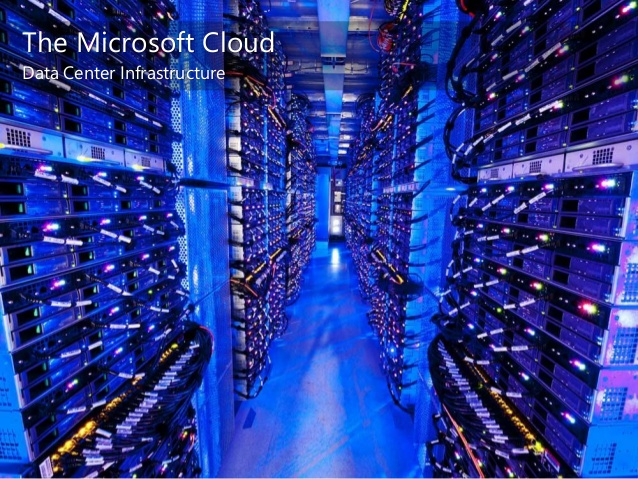

# Regions

* Regions are geographic locations in which public cloud service providers data centers reside
* Each Region is a gigantic data center or multiple interconnected data centers

* Azure operates over [30 regions](https://azure.microsoft.com/en-us/regions/) around the world with more being added
* Oracle Cloud operates over [10 regions](https://cloud.oracle.com/data-regions) and counting
