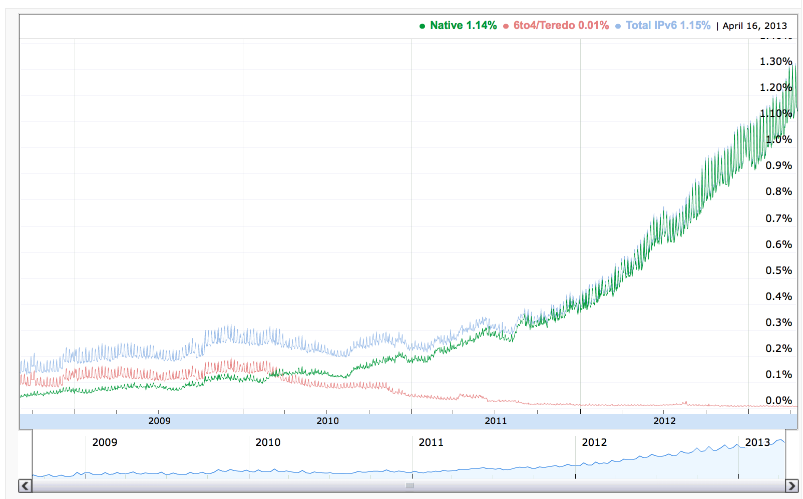

# IPv4 Addresses Shortage

* IPv4 address space [is crowded](https://en.wikipedia.org/wiki/IPv4_address_exhaustion)
* Routing between private network requires unique IP Address range for each subnet
* Unique subnets for private IPv4 could be a challenge in a large organization:
  * Across the world offices, branch locations, network segments and interconnected partners
  * Legacy networks and data centers with generous overallocation of a IPv4 address space
  * Routing with overlapping IP addresses is likely to be a [challenge](https://supportforums.cisco.com/t5/lan-switching-and-routing/avoid-private-ip-overlap/td-p/3179435)
* Adoption of IPv6 is growing, but
  * Cloud providers support for public IPv6 addresses varies: yes for [Aws](https://aws.amazon.com/about-aws/whats-new/2017/01/announcing-internet-protocol-version-6-ipv6-support-for-elastic-load-balancing-in-amazon-virtual-private-cloud-vpc/), yes for [Google Cloud](https://cloud.google.com/compute/docs/ip-addresses/reserve-static-external-ip-address), and no as much for [Azure](https://stackoverflow.com/questions/48190025/when-do-dynamic-ipv6-addresses-for-azure-load-balancer-front-end-configurations)
  * Is you organization ready for IPv6 addressing scheme?
  
