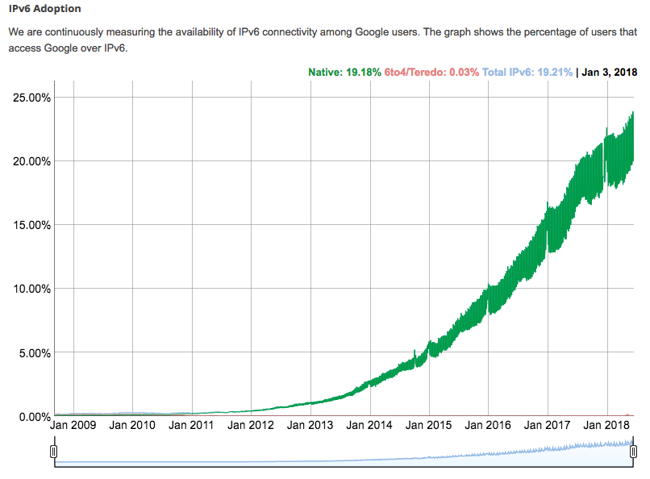

# IPv4 Addresses Shortage

* IPv4 address space [is crowded](https://en.wikipedia.org/wiki/IPv4_address_exhaustion) for public IP
* Unique subnets for private IPv4 could be a challenge too for a large organization:
  * Numerous subnets, branch locations, interconnected partners, etc.
  * Legacy networks and data centers with a generously overallocation of a IPv4 Address space
* Adoption of IPv6 is good, but is your organization there yet?
  
