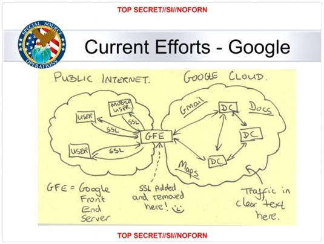

# VPN Managemnet

* VPN's have been used on-premises to extend the private network traffic to another location
* VPN is solving a problem of securing a network traffic over an otherwise insecure network
* In modern days HTTPS/TLS/SSH offer a strong encryption of a traffic over an insecure network
* Many legacy systems and applications tend to rely on a network layer protection
* An infamous diagram of a government agency's hacking into Google data centers and undermining the common notion of secure networks:

