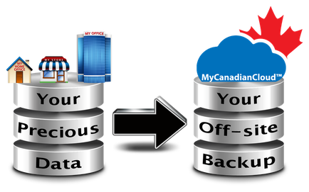

# Backup and Restore Options

## Overview

* Is there a difference between [on-premises and on-the-cloud backup & restore practices](https://www.itgct.com/cloud-backup-vs-on-premise-backups/)?
* What are your business obligation, downtime and time to recovery?
* How fast can you recover from a server failure, accidental data delete, a wide-spread power outage?
* On-premises there is an on-site and an off-site backup [practices](https://www.backupassist.com/education/articles/difference-between-onsite-and-offsite-data-backup.html)
* There is a data residency concerns where [local](http://www.mycanadiancloud.ca/_Media/your-data-your-backup_med.png) service providers jump in:

